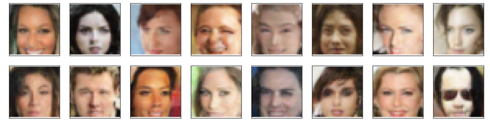

# Face Generation

In this project, we'll define and train a DCGAN on a dataset of faces. Our goal is to get a generator network to generate *new* images of faces that look as realistic as possible!

The project will be broken down into a series of tasks from **loading in data to defining and training adversarial networks**. At the end of the notebook, we'll be able to visualize the results of our trained Generator to see how it performs; our generated samples should look like fairly realistic faces with small amounts of noise.

### Get the Data

We'll be using the [CelebFaces Attributes Dataset (CelebA)](http://mmlab.ie.cuhk.edu.hk/projects/CelebA.html) to train our adversarial networks.

This dataset is more complex than the number datasets (like MNIST or SVHN) we've been working with, and so, we should prepare to define deeper networks and train them for a longer time to get good results. We'll utilize a GPU for training.

### Pre-processed Data

Since the project's main focus is on building the GANs, *some* of the pre-processing has already been done. Each of the CelebA images has been cropped to remove parts of the image that don't include a face, then resized down to 64x64x3 NumPy images. Some sample data is show below.

> If you are working locally, you can download this data [by clicking here](https://s3.amazonaws.com/video.udacity-data.com/topher/2018/November/5be7eb6f_processed-celeba-small/processed-celeba-small.zip)

This is a zip file that we'll need to extract in the home directory of this notebook for further loading and processing. After extracting the data, we should be left with a directory of data `processed_celeba_small/`

# Model performance and observations

I have run this model multiple times by changing the hyperparameters like conv-dim (64, 128, 256) and running for different numbers of epochs. It took way too much time for training as the conv-dim increased. I also used different batch sizes i.e. 64 and 128. The results are shown below. Unfortunately I forgot to take the screenshots for charts in 2 later iterations. However, the generated images can be seen below.

The generated results are very low resolution which can be improved by using a deeper model. Using residual blocks like the ones used in CycleGANs may also improve the model to train on larger images.

For lower conv-dim, it was faster to train the model but model still needs more trainig to learn some features. If you look at the row 1 and image 2 and row 1 image 5, some features of the faces are distorted.

For a higher conv-dim like 128, the results look better. You may notice that model even learnt sunglasses as part of the facial features in the bottom right image in fig 3.

It is also noticeable that increasing the conv_dim further to 256 and reducing epochs still generated good results, however, if trained for more epochs, the model could have learnt more features as some of the faces are distorted. But this would require much longer training time.

It would interesting to see how changing the learning rate could help which I haven't yet tried.

## Training with conv-dim = 64 & 100 Epochs

### Discriminator & Generate Loss Chart
_fig_ 1

### Generated Faces
_fig_ 2

## Training with conv-dim = 128 & 100 Epochs

### Generated Faces
_fig_ 3

## Training with conv-dim = 256 & 50 Epochs

### Generated Faces
_fig_ 4

Results generated as output of this model have been saved as pickle `.pkl` files.

_Note: `workspace_utils.py` was included to keep the Udacity workspace from dying during training process._